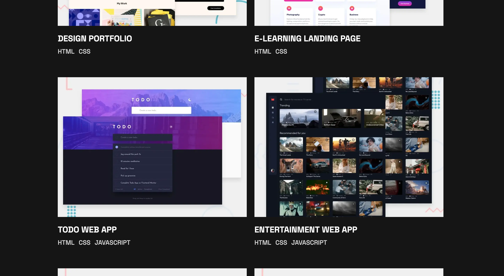

- [Overview](#overview)
  - [The challenge](#the-challenge)
  - [Screenshot](#screenshot)
  - [Links](#links)
- [My process](#my-process)
  - [Built with](#built-with)
  - [Useful resources](#useful-resources)
- [Author](#author)

## Overview

### The challenge

Users should be able to:

- Receive an error message when the `form` is submitted if:
  - Any field is empty
  - The email address is not formatted correctly
- View the optimal layout for the interface depending on their device's screen size
- See hover and focus states for all interactive elements on the page
- **Bonus**: Hook the form up so it sends and stores the user's enquiry (you can use a spreadsheet or Airtable to save the enquiries)
- **Bonus**: Add your own details (image, skills, projects) to replace the ones in the design

### Screenshot

Mobile Version:

Tablet Version:

Desktop Version:

### Links

- Solution URL: [Add solution URL here](https://github.com/BradwellC/FEM--Single-Page-Developer-Portfolio)
- Live Site URL: [Add live site URL here](https://bradwellc.github.io/FEM--Single-Page-Developer-Portfolio/)

## My process

### Built with

- Semantic HTML5 markup
- CSS custom properties
- Flexbox
- CSS Grid
- Mobile-first workflow

### Useful resources

- [Example resource 1](https://www.javascripttutorial.net/javascript-dom/javascript-form-validation/) - Getting a better idea of how to setup the form calidation.

## Author

- Frontend Mentor - [@yourusername](https://www.frontendmentor.io/profile/BradwellC)
